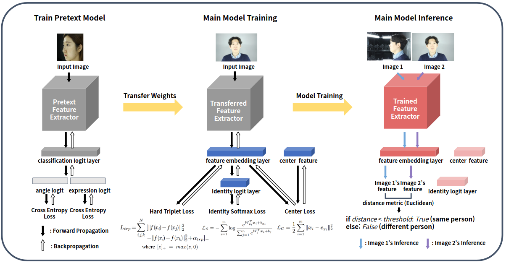

# AI Challenge 2020
이 레포지토리는 [mAy-I](https://may-i.io) 팀과 함께 참가한 2020년 6월 과학기술정보통신부에서 주최한 인공지능 온라인 경진대회 중 "얼굴 다각도 인식 및 조회 모델 개발" 과제를 위한 레포지토리입니다. "[과제 04] (경량화 5M) 얼굴 다각도 인식 및 조회 모델 개발" 과제에서 0.01 이상의 margin으로 1위를 차지하였습니다.


## 모델 설명
Triarchy 모델은 Identity Softmax loss, Hard Triplet(Soft Margin) loss, Center loss를 통해 face image의 semantic feature를 학습합니다.
- Identity Softmax loss는 identity마다의 discriminative한 feature를 모델이 학습하도록 합니다.
- Hard Triplet loss는 서로 다른 identity의 feature이 동일한 identity의 feature보다 상대적으로 멀리 떨어지도록 합니다.
- Center loss([Wen et al.](https://ydwen.github.io/papers/WenECCV16.pdf))는 동일한 identity의 feature들을 서로 최대한 가깝도록 유도합니다.

Backbone으로는 [Tan et al.](http://proceedings.mlr.press/v97/tan19a/tan19a.pdf)의 EfficientNet-B0 network architecture를 사용하였고, 그 위에 feature embedding layer와 identity logit을 위한 layer를 추가하였습니다. 특히 [Liu et al.](https://arxiv.org/pdf/1908.01683v1.pdf)를 참조하여 feature space의 효율적인 학습을 위해 feature embedding layer 이후에는 batch normalization을 시행하지 않았고, discriminative feature의 효율적인 학습을 위해 identity logit layer 이후에는 batch normalization을 시행하였습니다.

단 추론 시에는 feature embedding layer를 제외한 다른 layer들을 모두 제거함으로써 모델을 최대한 경량화하였습니다. 그 결과 최종 모델의 parameter 수는 총 4,663,420개입니다.

또한 대회 규정상 외부 데이터셋에 대한 pretrained weight을 사용할 수 없는 관계로, 이미지의 facial expression 및 camera angle을 학습하도록 한 Pretext 모델을 학습하였고, 이를 통해 얻어낸 EfficientNet backbone의 weight을 Triarchy 모델의 weight initialization으로 활용하였습니다. 이를 통해 모델의 성능이 개선된 것을 확인할 수 있었습니다.

- Validation set accuracy: 0.989
- Test set accuracy: 0.987



## 성능 재현
다음의 프로세스를 통해 모델 성능을 재현할 수 있습니다. Random seed가 고정되어 있기 때문에 정확한 성능의 재현이 가능합니다.

먼저 Pretext 모델을 학습한 후, 해당 가중치를 통해 Triarchy 모델을 fine-tuning합니다. 마지막으로 학습된 모델을 가지고 test set의 label을 추론합니다.

결과 파일은 `results/test/`에, 학습 로그 파일 및 가중치 파일은 `results/train/`에 저장됩니다. 데이터는 대회 환경 그대로 `/datasets/objstrgzip/03_face_verification_angle/`에 있는 것으로 상정하였습니다. 데이터셋 경로의 변경을 위해서는 모델의 `Dataset` 클래스들과 `train.py`, `evaluate.py` 파일을 수정해야 합니다.

```
python train_pretext.py
python train.py --pretrained_weight results/train/weights/PRETEXT_MODEL_WEIGHT  # train_pretext.py를 통해 생성된 weight 파일 경로
python evaluate.py --model_weight results/train/weights/MODEL_WEIGHT  # train.py를 통해 생성된 weight 파일 경로
```

혹은 다음의 코드로도 전체 프로세스를 진행할 수 있습니다. 하지만 시간 관계상 테스트해보지 못했으므로, 정확한 재현을 확신할 수 없음을 주의해야 합니다.

```
python run.py
```
